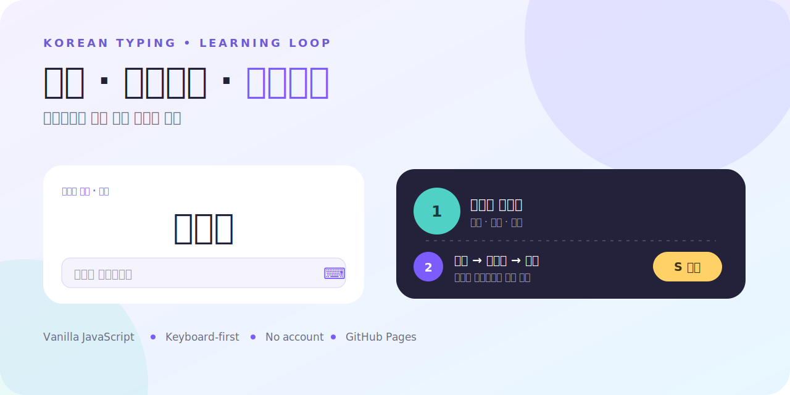
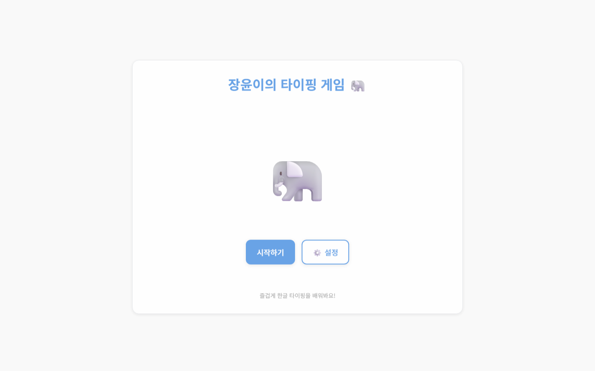

# 장윤이 한글 타이핑 게임 🐘

> 낱말을 보고, 입력하고, 즉시 피드백 받는 초등학생용 한글 타이핑 학습 루프.

[](#기술-구조)
[](#사용-방법)
[](#주요-기능)
[](https://shinjaehyun20.github.io/02-hangul-typing-game/)
[](LICENSE)

[](https://shinjaehyun20.github.io/02-hangul-typing-game/)

**[한 번에 시작하기](https://shinjaehyun20.github.io/02-hangul-typing-game/)** · 설치 없음 · 기록은 내 브라우저에만 저장

| 1. 난이도 선택 | 2. 낱말 입력 | 3. 결과 확인 |
| --- | --- | --- |
| 초급 · 중급 · 고급 | 즉시 정오답·효과음 피드백 | 정확도·점수·S~D 등급 |



## ✨ 주요 기능

- 🎮 **3단계 난이도**: 초급, 중급, 고급
- 🏆 **점수 및 등급 시스템**: S/A/B/C/D 등급
- 💾 **학습 기록 자동 저장**: 최고 점수와 등급 저장
- 🔊 **효과음**: 정답/오답 피드백 사운드
- 🎨 **애니메이션**: 캐릭터 및 UI 애니메이션
- ⚙️ **설정 기능**: 효과음, 글꼴 크기, 단어 수 조절
- ♿ **접근성**: 키보드만으로 전체 조작 가능

## 🚀 로컬 실행 방법

### 간단한 방법 (Python 서버)

```bash
# Python 3가 설치되어 있다면
python -m http.server 8000

# 또는 Python 2
python -m SimpleHTTPServer 8000
```

그 다음 브라우저에서 http://localhost:8000 으로 접속하세요.

### Live Server (VS Code 확장)

1. VS Code에서 "Live Server" 확장 설치
2. `index.html` 파일에서 우클릭
3. "Open with Live Server" 선택

## 기술 구조

```
./
├── index.html             # 앱 셸
├── styles.css             # 반응형 UI
├── data/
│   └── words.json         # 단어 데이터
├── src/
│   ├── app.js             # 앱 진입점
│   ├── router.js          # 라우터
│   ├── utils/
│   │   ├── storage.js     # localStorage 관리
│   │   ├── sound.js       # 사운드 관리
│   │   └── grade.js       # 등급 계산
│   └── screens/
│       ├── home.js        # 홈 화면
│       ├── levelSelect.js # 레벨 선택
│       ├── game.js        # 게임 화면
│       ├── result.js      # 결과 화면
│       └── settings.js    # 설정 화면
└── README.md
```

## 사용 방법

1. **시작하기**: 홈 화면에서 "시작하기" 버튼 클릭
2. **레벨 선택**: 초급/중급/고급 중 하나 선택
3. **타이핑**: 화면에 나타나는 단어를 입력창에 입력
4. **결과 확인**: 모든 단어를 완료하면 점수와 등급 확인

## 📊 등급 기준

- **S등급**: 100% 정확도 (완벽!)
- **A등급**: 90~99% 정확도
- **B등급**: 80~89% 정확도
- **C등급**: 70~79% 정확도
- **D등급**: 70% 미만

## ⚙️ 설정

설정 화면에서 다음을 조절할 수 있습니다:

- **효과음**: ON/OFF
- **글꼴 크기**: 작게/보통/크게
- **단어 개수**: 10개/20개/30개
- **기록 초기화**: 모든 학습 기록 삭제

## 기술 스택

- **순수 JavaScript** (ES6+)
- **HTML5 & CSS3**
- **Web Audio API** (사운드)
- **localStorage API** (데이터 저장)
- **모듈 시스템** (ES6 Modules)

## 🌐 브라우저 호환성

- ✅ Chrome 90+
- ✅ Edge 90+
- ✅ Safari 14+
- ✅ Firefox 88+

## 📝 라이선스

MIT License

## 🎯 향후 개선 계획

- [x] 모바일 반응형 디자인
- [ ] 타이핑 속도(WPM) 측정
- [ ] 오답 단어 복습 모드
- [ ] 실제 효과음 파일 추가
- [ ] 캐릭터 선택 기능
- [ ] 커스텀 단어 세트 업로드

## 📞 문의

문제가 발생하거나 제안사항이 있으시면 이슈를 등록해주세요.

---

Made with ❤️ for 장윤이
