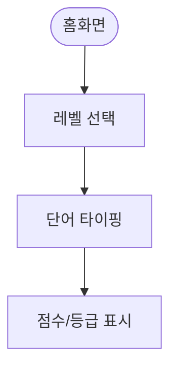

# 02 한글 타이핑 게임 사양서 (초안)

## 1. 프로젝트 기본 정보

- 프로젝트명: 장윤이 한글 타이핑 연습
- 유형: 웹 애플리케이션 (교육 게임)
- 목적: 아동의 한글 타이핑 능력 향상
- 타겟 사용자: 초등학교 저학년 아동 (7~10세)
- 예상 개발 기간: 1~2주 (토이 프로젝트 기준)

## 2. 요구사항 정의

### 2.1 기능 요구사항

- 단어 타이핑: 화면 단어를 입력하고 정답/오답 피드백 제공
- 단계/레벨: 난이도별 단어 세트 제공
- 점수/진도: 정확도/속도 기반 점수 및 진도 관리
- 애니메이션: 정답/오답 시 아동 친화 애니메이션

### 2.2 비기능 요구사항

- 반응형 레이아웃 (PC/태블릿)
- 접근성 고려 (키보드 중심 인터랙션)

## 3. 기술 스택

- 프론트엔드: React 또는 Vanilla JS + HTML/CSS
- 배포: GitHub Pages/Vercel

## 4. 디자인 요구사항

- 파스텔톤 색상, 큰 버튼, 명확한 피드백 색상

## 5. 개발 프로세스

- 레벨/단어 데이터 설계 → UI 구성 → 채점/점수 로직 → 애니메이션 → 배포

## 6. 데이터 모델 (간단)

- words.json: { level: string, items: string[] }

## 사용자 흐름

- 홈화면 → 레벨 선택 → 게임 플레이(입력) → 점수 확인

